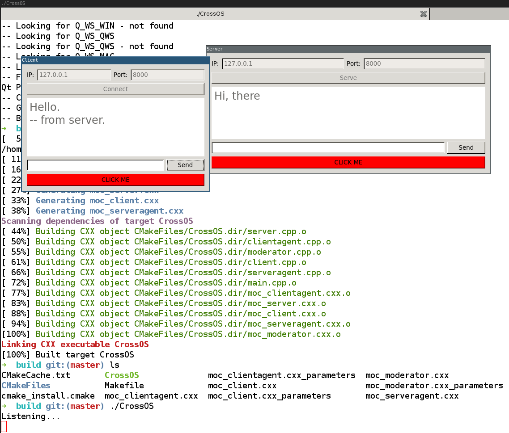

# CrossOS
Cross OS Communication

测试长沙桥康项目中两台电脑的通信。后来加入了 Moderator 模块，实现了指令的互相传递。
这一切都归功于：

  * TCP/IP
  * QT 的 DataStream


详细见文档：<http://tangzx.qiniudn.com/post-0059-exe-wrapper.html> （那个程序比这个复杂很多，那是以此为基础修改的。）

---

## How to?

### 安装

- Windows: <https://mirrors.ustc.edu.cn/qtproject/official_releases/>
- Linux: `apt-get ...qt blahblah`，或者到 Qt 官网或镜像站下载一个离线 `.run` 文件安装

### 编译

**Windows**

用 CMake-GUI 的界面生成 Visual Studio 工程。

**Linix**

```bash
cd CrossOS
mkdir build && cd build
cmake ..
make
./CrossOS
```

Linux 上也编译通过了：


